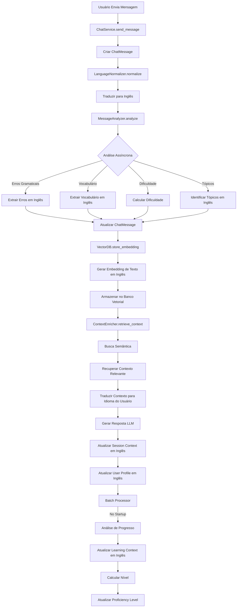

# Plano: Sistema de Coleta de Informações do Usuário

## Objetivo
Implementar sistema completo de captação, análise e armazenamento de informações do usuário para:
- Identificar nível de conhecimento baseado em interação
- Acompanhar evolução ao longo do tempo
- Personalizar interações e auxiliar no desenvolvimento do aprendizado
- Otimizar armazenamento para histórico de evolução eficiente
- Implementar busca semântica para recuperação inteligente de contexto

## Módulo de Banco Vetorial

### Estrutura do Módulo
O sistema utilizará um **módulo dedicado** (`backend/app/modules/vector_db/`) para gerenciar todas as operações relacionadas a banco vetorial. Este módulo será:

- **Modular**: Pode ser usado independentemente ou integrado
- **Extensível**: Suporta diferentes implementações (ChromaDB, Pinecone, pgvector)
- **Otimizado**: Focado em performance e escalabilidade
- **Isolado**: Separação clara de responsabilidades

### Responsabilidades do Módulo
- Geração e armazenamento de embeddings
- Busca semântica e recuperação de contexto
- Gerenciamento de collections/namespaces
- Sincronização com PostgreSQL
- Otimização e manutenção

## Arquitetura Geral

### Sistema de Tradução para Inglês (Normalização de Dados)

**IMPORTANTE**: Todas as informações coletadas e analisadas devem ser armazenadas em **inglês** para padronização e melhor performance dos modelos. A exibição e interação com o usuário permanece no idioma selecionado.

#### Regra de Normalização
- **Armazenamento**: Sempre em inglês (banco de dados estrutural e banco vetorial)
- **Exibição**: No idioma do usuário (tradução reversa quando necessário)
- **Análise**: Processamento em inglês para consistência

#### Implementação

**Serviço de Normalização**: `backend/app/services/language_normalizer.py`

**Responsabilidades**:
- Traduzir textos para inglês antes de armazenar
- Traduzir de volta para idioma do usuário na exibição
- Normalizar tópicos, erros e vocabulário para inglês
- Manter cache de traduções frequentes

**Métodos principais**:
```python
class LanguageNormalizer:
    def normalize_for_storage(
        self,
        text: str,
        source_language: str,
        target_language: str = "en"
    ) -> str:
        """Traduz texto para inglês antes de armazenar"""
        
    def normalize_for_display(
        self,
        text: str,
        source_language: str = "en",
        target_language: str
    ) -> str:
        """Traduz texto de inglês para idioma do usuário"""
        
    def normalize_topics(
        self,
        topics: List[str],
        source_language: str
    ) -> List[str]:
        """Normaliza lista de tópicos para inglês"""
        
    def normalize_error_types(
        self,
        error_data: Dict,
        source_language: str
    ) -> Dict:
        """Normaliza tipos de erro para inglês"""
```

**Pontos de Integração**:
1. **MessageAnalyzer**: Analisa em inglês, armazena em inglês
2. **VectorDB**: Embeddings gerados de textos em inglês
3. **SessionContextManager**: Contexto armazenado em inglês
4. **ProgressTracker**: Métricas e evolução em inglês
5. **API Responses**: Traduzir de volta para idioma do usuário

**Estratégia de Tradução** (Baseada no Sistema de Vídeos):

**Prioridade 1: Ferramentas de Tradução** (deep-translator, googletrans)
- Mais rápidas (50-200ms por tradução)
- Não consomem tokens de LLM
- Boa qualidade para textos simples e termos técnicos
- Reutiliza infraestrutura existente do sistema de vídeos

**Prioridade 2: LLM** (Gemini, etc.)
- Melhor qualidade para contextos complexos
- Fallback quando ferramentas falham
- Usa API keys free disponíveis (já configuradas)

**Cache Agressivo**:
- Cache de traduções comuns (ex: "verb_tense" sempre = "verb_tense")
- Dicionário de termos técnicos pré-definidos
- Cache em memória ou Redis para performance

**Fallback**:
- Se todas as ferramentas falharem, armazenar texto original com flag
- Tentar novamente em processamento assíncrono
- Notificar se falha persistir

### Fluxo de Coleta de Dados (Atualizado)



### Estrutura de Dados

#### 1. Análise de Mensagem (ChatMessage)
- `grammar_errors` (JSONB): Lista de erros detectados (em inglês)
- `vocabulary_suggestions` (JSONB): Palavras e sugestões (em inglês)
- `difficulty_score` (Float): 0.0 a 1.0
- `topics` (JSONB): Tópicos identificados (em inglês)
- `analysis_metadata` (JSONB): Metadados da análise
  - `analyzed_at`: Timestamp da análise
  - `analyzer_version`: Versão do analisador usado
  - `confidence_scores`: Scores de confiança por tipo de análise
  - `processing_time_ms`: Tempo de processamento em milissegundos
  - `original_language`: Idioma original da mensagem
  - `normalized_language`: Idioma normalizado (sempre "en")

#### 2. Contexto de Sessão (ChatSession.session_context)
**Nota**: Todos os dados armazenados em inglês
```json
{
  "topics_discussed": ["greetings", "food"],
  "common_errors": {
    "verb_tense": {"count": 5, "examples": [...], "last_seen": "2024-02-01T10:30:00Z"},
    "articles": {"count": 3, "examples": [...], "last_seen": "2024-02-01T10:25:00Z"}
  },
  "vocabulary_used": {
    "new_words": ["restaurant", "airport"],
    "total_unique_words": 45,
    "words_by_difficulty": {"easy": 20, "medium": 15, "hard": 10}
  },
  "difficulty_trend": "increasing",
  "session_insights": {
    "most_common_error": "verb_tense",
    "improvement_areas": ["past_tense"],
    "session_start_time": "2024-02-01T10:00:00Z",
    "last_activity": "2024-02-01T10:30:00Z"
  }
}
```

#### 3. Contexto de Aprendizado (UserProfile.learning_context)
```json
{
  "proficiency_evolution": [
    {"date": "2024-01-01", "level": "beginner", "score": 0.3},
    {"date": "2024-02-01", "level": "intermediate", "score": 0.55}
  ],
  "recurring_errors": [
    {"type": "verb_tense", "frequency": 15, "last_seen": "2024-02-01", "severity": "high"}
  ],
  "vocabulary_acquired": {
    "total_words": 250,
    "mastered_words": 180,
    "learning_words": 70
  },
  "topics_mastery": {
    "greetings": 0.9,
    "food": 0.7,
    "travel": 0.5
  },
  "learning_preferences": {
    "style": "conversational",
    "preferred_topics": ["travel"],
    "best_time": "evening"
  }
}
```

#### 4. Banco Vetorial (Vector Database)
**Collections/Namespaces**:

**IMPORTANTE**: Todas as collections são separadas por `user_id` para isolamento de dados. Filtros por `user_id` são obrigatórios em todas as operações.

- **user_messages**: Embeddings de mensagens do usuário (texto em inglês)
  - Metadata: `user_id` (obrigatório), `session_id`, `message_id`, `created_at`, `topics` (em inglês), `difficulty_score`, `original_language`
  
- **topics**: Embeddings de tópicos discutidos (em inglês)
  - Metadata: `user_id` (obrigatório), `topic_name` (em inglês), `frequency`, `last_discussed`
  
- **corrections**: Embeddings de erros e correções (em inglês)
  - Metadata: `user_id` (obrigatório), `error_type` (em inglês), `original_text` (em inglês), `corrected_text` (em inglês), `frequency`
  
- **vocabulary**: Embeddings de vocabulário aprendido (em inglês)
  - Metadata: `user_id` (obrigatório), `word` (em inglês), `context` (em inglês), `mastery_level`, `first_seen`, `last_used`
  
- **session_contexts**: Embeddings de contextos de sessões (em inglês)
  - Metadata: `user_id` (obrigatório), `session_id`, `summary` (em inglês), `key_insights` (em inglês)

**Isolamento por Usuário**:
- Todas as buscas devem incluir filtro `user_id` obrigatório
- Collections podem ser particionadas por usuário (namespace por user_id)
- Backup e limpeza podem ser feitos por usuário específico
- Não há necessidade de criptografia, apenas isolamento lógico

## Visão Geral das Fases

O plano está dividido em **7 fases progressivas**:

- **Fases 1-4**: Sistema básico de coleta e análise (sem banco vetorial)
  - ✅ Fase 1: Análise básica de mensagens - **CONCLUÍDA**
  - ⏸️ Fase 2: Atualização de contexto de sessão - **PAUSADA**
  - ⏸️ Fase 3: Tracking de progresso e evolução - **PENDENTE**
  - ⏸️ Fase 4: Personalização e utilização do contexto - **PENDENTE**

- **Fases 5-7**: Implementação de banco vetorial e busca semântica
  - ⏸️ Fase 5: Infraestrutura de banco vetorial - **PENDENTE**
  - ⏸️ Fase 6: Busca semântica e RAG - **PENDENTE**
  - ⏸️ Fase 7: Integração completa e otimização - **PENDENTE**

**Nota**: As Fases 1-4 podem ser implementadas independentemente. As Fases 5-7 dependem da infraestrutura das fases anteriores, mas podem ser implementadas em paralelo após a Fase 2.

**Status Atual do Projeto**:
- ✅ **Fase 1 concluída**: Sistema de análise básica implementado e funcionando
- ⏸️ **Pausado para melhorias no chat**: Priorizando melhorias na interface de seleção de modelos e qualidade da conversa antes de continuar com a coleta de dados
- 📝 **Decisão estratégica**: Melhorar UX do chat primeiro para garantir que os dados coletados venham de conversas de alta qualidade

## Fase 1: Análise Básica de Mensagens ✅ CONCLUÍDA

### Objetivo
Implementar análise de mensagens do usuário para extrair erros, vocabulário e dificuldade. **Análise será processada de forma assíncrona** para não impactar latência da resposta.

### Status da Implementação
**Data de Conclusão**: 2025-01-19

**Tarefas Concluídas**:
- ✅ 1.0 LanguageNormalizer Service criado e funcionando
- ✅ 1.1 MessageAnalyzer Service criado e funcionando
- ✅ 1.2 Integração no ChatService com processamento assíncrono
- ✅ 1.3 Campos `topics` e `analysis_metadata` adicionados ao modelo
- ✅ 1.4 Schemas Pydantic criados e ChatMessageResponse atualizado
- ✅ 1.5 Validação de dados implementada
- ✅ Migração de banco de dados executada com sucesso
- ✅ Script de verificação criado (`backend/verify_context_saving.py`)

**Arquivos Criados**:
- `backend/app/services/language_normalizer.py` - Normalização de idioma
- `backend/app/services/message_analyzer.py` - Análise de mensagens
- `backend/app/schemas/analysis_schemas.py` - Schemas de validação
- `backend/migrate_add_analysis_fields.py` - Script de migração
- `backend/verify_context_saving.py` - Script de verificação de contexto
- `docs/erros_gemini_api.md` - Documentação de erros da API Gemini

**Arquivos Modificados**:
- `backend/app/models/database.py` - Adicionados campos `topics` e `analysis_metadata`
- `backend/app/services/chat_service.py` - Integração de análise assíncrona
- `backend/app/schemas/schemas.py` - Atualizado `ChatMessageResponse`
- `backend/app/api/routes/chat.py` - Atualizado para retornar novos campos
- `backend/app/services/model_router.py` - Melhorias no roteamento de modelos
- `backend/app/services/llm_service.py` - Melhorias no tratamento de erros e roteamento
- `backend/app/services/gemini_service.py` - Melhorias no tratamento de erros
- `backend/app/services/token_usage_service.py` - user_id opcional

**Notas de Implementação**:
- Processamento assíncrono implementado usando threading (sem dependência de fila externa)
- Cache de traduções em memória com TTL de 30 dias
- Validação Pydantic antes de armazenar no banco
- Migração de banco executada: colunas `topics` e `analysis_metadata` adicionadas sem perda de dados
- Sistema de fallback de tradução: deep-translator → googletrans → gemini
- **Melhorias no roteamento de modelos**:
  - Bloqueio temporário de modelos (não permanente) com TTL configurável
  - Listagem dinâmica de modelos quando todos estão bloqueados
  - Filtro de modelos inadequados (embedding, veo, etc.) para geração de texto
  - Aumento de tentativas baseado em modelos disponíveis (até 50 tentativas)
  - Tratamento melhorado de erros 404 e 429
  - Limpeza automática de bloqueios temporários expirados

**Testes Realizados**:
- ✅ Verificação de salvamento de contexto executada com sucesso
- ✅ Análise assíncrona funcionando (metadata e difficulty_score sendo salvos)
- ✅ Contexto da conversa sendo construído corretamente
- ✅ Mensagens sendo salvas no banco de dados

**Status Atual**:
- ✅ Fase 1 implementada e funcional
- ⏸️ **PAUSADO**: Decisão de melhorar chat (seleção de modelos e qualidade da conversa) antes de continuar com Fase 2
- 📝 **Nota**: Dados coletados serão zerados posteriormente (em desenvolvimento)

**Próximos Passos**:
- Melhorar interface de seleção de modelos no chat
- Melhorar qualidade da conversa (prompts e contexto)
- Retomar Fase 2 após melhorias no chat

### Tarefas

#### 1.0 Criar LanguageNormalizer Service
**Arquivo**: `backend/app/services/language_normalizer.py`

**Responsabilidades**:
- Traduzir textos para inglês antes de armazenar
- Traduzir de volta para idioma do usuário na exibição
- Normalizar tópicos, erros e vocabulário
- Cache de traduções frequentes
- **Usar ferramentas de tradução (prioridade) ou LLM (fallback)**

**Estratégia de Tradução**:
1. **Prioridade 1**: Ferramentas de tradução (deep-translator, googletrans)
   - Mais rápidas (50-200ms)
   - Não consomem tokens de LLM
   - Boa qualidade para textos simples
2. **Prioridade 2**: LLM (Gemini, etc.)
   - Melhor qualidade para contextos complexos
   - Fallback quando ferramentas falham
   - Usa API keys free disponíveis

**Métodos principais**:
```python
class LanguageNormalizer:
    def __init__(self, translation_service_factory: TranslationServiceFactory):
        # Usa factory existente do sistema de vídeos
        self.translation_service = translation_service_factory.create_auto_fallback(
            preferred_service="deeptranslator",  # Mais rápido
            fallback_services=["googletrans", "gemini"],  # Fallbacks
            configs={...}
        )
        self.cache = {}  # Cache em memória (pode usar Redis)
        
    def normalize_for_storage(
        self,
        text: str,
        source_language: str
    ) -> str:
        """Traduz texto para inglês antes de armazenar"""
        # Verifica cache primeiro
        cached = self._get_cached_translation(text, source_language, "en")
        if cached:
            return cached
            
        # Tenta ferramenta de tradução primeiro (rápido)
        try:
            translated = self.translation_service.translate_text(
                text, "en", source_language
            )
            self._cache_translation(text, source_language, "en", translated)
            return translated
        except Exception as e:
            logger.warning(f"Falha na tradução com ferramenta: {e}")
            # Fallback para LLM se necessário
            raise
        
    def normalize_for_display(
        self,
        text: str,
        target_language: str
    ) -> str:
        """Traduz texto de inglês para idioma do usuário"""
        if target_language == "en":
            return text  # Já está em inglês
            
        cached = self._get_cached_translation(text, "en", target_language)
        if cached:
            return cached
            
        translated = self.translation_service.translate_text(
            text, target_language, "en"
        )
        self._cache_translation(text, "en", target_language, translated)
        return translated
        
    def normalize_topics(self, topics: List[str], source_language: str) -> List[str]
    def normalize_error_types(self, error_data: Dict, source_language: str) -> Dict
    def _get_cached_translation(self, text: str, source: str, target: str) -> Optional[str]
    def _cache_translation(self, text: str, source: str, target: str, translated: str)
```

**Comparação de Performance**:

| Método | Velocidade | Qualidade | Custo | Uso Recomendado |
|--------|-----------|----------|-------|----------------|
| deep-translator | 50-200ms | Boa | Grátis | Textos simples, termos técnicos |
| googletrans | 100-300ms | Boa | Grátis | Fallback de deep-translator |
| LLM (Gemini) | 1-3s | Excelente | Free tier | Contextos complexos, fallback |

#### 1.1 Criar MessageAnalyzer Service
**Arquivo**: `backend/app/services/message_analyzer.py`

**Responsabilidades**:
- Analisar mensagens do usuário usando LLM (mensagem já normalizada para inglês)
- Extrair erros gramaticais estruturados (em inglês)
- Identificar vocabulário usado (em inglês)
- Calcular dificuldade da mensagem
- Identificar tópicos principais (em inglês)
- **Processamento assíncrono** para não bloquear resposta

**Métodos principais**:
```python
class MessageAnalyzer:
    def analyze_message(
        self, 
        message: str,  # Já normalizada para inglês
        language: str,  # Idioma original
        user_level: str
    ) -> Dict:
        """Analisa mensagem e retorna análise estruturada (tudo em inglês)"""
        
    def analyze_message_async(
        self,
        message_id: UUID,
        message: str,
        language: str,
        user_level: str
    ) -> None:
        """Analisa mensagem de forma assíncrona (background job)"""
        
    def _extract_grammar_errors(self, message: str, language: str) -> List[Dict]
    def _extract_vocabulary(self, message: str, language: str) -> Dict
    def _calculate_difficulty(self, message: str, language: str, user_level: str) -> float
    def _identify_topics(self, message: str) -> List[str]
    def _build_analysis_metadata(self, processing_time: float) -> Dict
```

#### 1.2 Integrar Análise no ChatService
**Arquivo**: `backend/app/services/chat_service.py`

**Modificações**:
- Adicionar `MessageAnalyzer` e `LanguageNormalizer` no `__init__`
- **Fluxo síncrono**: Criar `user_message`, retornar resposta imediata
- **Fluxo assíncrono**: Enfileirar análise em background após resposta
- Armazenar resultados em `grammar_errors`, `vocabulary_suggestions`, `difficulty_score`, `topics`
- Adicionar campo `topics` e `analysis_metadata` em `ChatMessage` (migration)

**Fluxo de Processamento**:
1. Usuário envia mensagem
2. Normalizar mensagem para inglês
3. Criar ChatMessage (sem análise ainda)
4. Gerar resposta imediata (sem análise)
5. Enfileirar análise assíncrona
6. Background job: Analisar, atualizar ChatMessage, atualizar contexto

#### 1.3 Criar Migration para Campos Adicionais
**Arquivo**: `backend/migrations/add_analysis_fields_to_chat_message.py`

Adicionar colunas:
- `topics` (JSONB): Tópicos identificados (em inglês)
- `analysis_metadata` (JSONB): Metadados da análise

#### 1.4 Atualizar Schemas
**Arquivo**: `backend/app/schemas/schemas.py`

Adicionar:
- `topics` em `ChatMessageResponse`
- `analysis_metadata` em `ChatMessageResponse`
- Schemas Pydantic para validação de estruturas JSONB (ver Fase 1.5)

#### 1.5 Implementar Validação de Dados
**Arquivo**: `backend/app/schemas/analysis_schemas.py`

Criar schemas Pydantic para validação de estruturas JSONB:
```python
class GrammarErrorSchema(BaseModel):
    type: str  # Em inglês
    original: str
    corrected: str
    explanation: Optional[str] = None
    confidence: float  # 0.0 a 1.0

class VocabularySuggestionSchema(BaseModel):
    word: str  # Em inglês
    suggestion: Optional[str] = None
    context: Optional[str] = None
    difficulty: str  # "easy", "medium", "hard"

class AnalysisMetadataSchema(BaseModel):
    analyzed_at: datetime
    analyzer_version: str
    confidence_scores: Dict[str, float]
    processing_time_ms: float
    original_language: str
    normalized_language: str = "en"
```

**Uso**: Validar dados antes de armazenar em JSONB

## Fase 2: Atualização de Contexto de Sessão ⏸️ PAUSADA

### Objetivo
Implementar atualização dinâmica do `session_context` durante a sessão.

### Status
⏸️ **PAUSADA** - Priorizando melhorias no chat (seleção de modelos e qualidade da conversa) antes de continuar com a coleta de dados.

### Tarefas

#### 2.1 Criar SessionContextManager
**Arquivo**: `backend/app/services/session_context_manager.py`

**Responsabilidades**:
- Gerenciar contexto da sessão
- Agregar erros, vocabulário e tópicos
- Calcular tendências (dificuldade, progresso)
- Identificar áreas de melhoria

**Métodos principais**:
```python
class SessionContextManager:
    def update_session_context(
        self,
        session: ChatSession,
        message_analysis: Dict
    ) -> Dict:
        """Atualiza contexto da sessão com nova análise"""
        
    def _aggregate_errors(self, session_context: Dict, new_errors: List) -> Dict
    def _aggregate_vocabulary(self, session_context: Dict, new_vocab: Dict) -> Dict
    def _update_topics(self, session_context: Dict, new_topics: List) -> List
    def _calculate_trends(self, session_context: Dict) -> Dict
```

#### 2.2 Integrar no ChatService
**Arquivo**: `backend/app/services/chat_service.py`

**Modificações**:
- Adicionar `SessionContextManager` no `__init__`
- Chamar `update_session_context` após análise de mensagem
- Salvar `session_context` atualizado no banco

#### 2.3 Inicializar Session Context
**Arquivo**: `backend/app/services/chat_service.py`

Modificar `create_session` para inicializar `session_context` vazio.

## Fase 3: Tracking de Progresso e Evolução

### Objetivo
Implementar sistema de acompanhamento de evolução do usuário ao longo do tempo.

### Tarefas

#### 3.1 Criar ProgressTracker Service
**Arquivo**: `backend/app/services/progress_tracker.py`

**Responsabilidades**:
- Calcular progresso baseado em métricas
- Atualizar `learning_context` do `UserProfile`
- Identificar erros recorrentes
- Calcular evolução de vocabulário
- Determinar mudanças de nível

**Métodos principais**:
```python
class ProgressTracker:
    def update_user_progress(
        self,
        user_id: UUID,
        session_analysis: Dict
    ) -> Dict:
        """Atualiza progresso do usuário"""
        
    def _calculate_proficiency_score(self, user_profile: UserProfile) -> float
    def _identify_recurring_errors(self, user_id: UUID) -> List[Dict]
    def _update_vocabulary_stats(self, user_id: UUID, new_words: List) -> Dict
    def _check_level_change(self, user_profile: UserProfile) -> Optional[str]
```

#### 3.2 Criar Batch Processor
**Arquivo**: `backend/app/services/batch_analyzer.py`

**Responsabilidades**:
- Processar análises em lote (assíncrono)
- Analisar múltiplas sessões
- Calcular métricas agregadas
- Atualizar `learning_context` periodicamente

**Métodos principais**:
```python
class BatchAnalyzer:
    def process_all_pending_messages(
        self,
        batch_size: int = 100
    ) -> Dict:
        """Processa todas as mensagens pendentes (não analisadas)"""
        # Busca mensagens do usuário sem análise completa
        # Agrupa em lotes de batch_size
        # Processa cada lote
        
    def process_user_sessions(
        self,
        user_id: UUID,
        days: int = 30,
        batch_size: int = 100
    ) -> Dict:
        """Processa sessões do usuário e atualiza progresso"""
        
    def process_user_pending_messages(
        self,
        user_id: UUID,
        batch_size: int = 100
    ) -> Dict:
        """Processa mensagens pendentes de um usuário específico"""
        # Busca mensagens do usuário (role="user") sem analysis_metadata
        # ou com analysis_metadata indicando análise incompleta
        
    def _get_pending_messages(
        self,
        limit: int = 100
    ) -> List[ChatMessage]:
        """Retorna mensagens pendentes de análise"""
        # Filtra: role="user" AND (analysis_metadata IS NULL OR incomplete)
        
    def _analyze_error_patterns(self, messages: List[ChatMessage]) -> Dict
    def _analyze_vocabulary_evolution(self, messages: List[ChatMessage]) -> Dict
    def _calculate_improvement_metrics(self, user_id: UUID) -> Dict
    def _handle_batch_failure(self, user_id: UUID, error: Exception) -> None
```

**Nota sobre Mensagens**:
- **Mensagens do usuário**: `ChatMessage.role == "user"` (mensagens enviadas pelo usuário)
- **Mensagens pendentes**: Mensagens sem `analysis_metadata` ou com análise incompleta
- **Batch size**: Refere-se a quantidade de mensagens do usuário processadas por vez

#### 3.3 Integrar Batch Processing no Startup
**Arquivo**: `backend/app/main.py`

**Modificações**:
- Adicionar evento `@app.on_event("startup")` para executar batch processing
- Executar em background thread para não bloquear startup
- Processar apenas mensagens pendentes (não analisadas)

**Implementação**:
```python
from fastapi import FastAPI
import threading
from app.services.batch_analyzer import BatchAnalyzer
from app.database import SessionLocal

@app.on_event("startup")
async def startup_batch_processing():
    """Executa batch processing quando backend inicia"""
    def run_batch():
        db = SessionLocal()
        try:
            batch_analyzer = BatchAnalyzer(db)
            # Processa apenas mensagens pendentes
            result = batch_analyzer.process_all_pending_messages()
            logger.info(f"Batch processing concluído: {result}")
        except Exception as e:
            logger.error(f"Erro no batch processing: {e}")
        finally:
            db.close()
    
    # Executa em thread separada para não bloquear startup
    thread = threading.Thread(target=run_batch, daemon=True)
    thread.start()
    logger.info("Batch processing iniciado em background")
```

**Alternativa (se quiser executar após startup completo)**:
```python
@app.on_event("startup")
async def startup_batch_processing():
    """Executa batch processing após startup completo"""
    # Aguarda alguns segundos para garantir que API está pronta
    import asyncio
    await asyncio.sleep(5)
    
    def run_batch():
        # ... mesmo código acima
        pass
    
    thread = threading.Thread(target=run_batch, daemon=True)
    thread.start()
```

#### 3.4 Integrar no ChatService
**Arquivo**: `backend/app/services/chat_service.py`

Chamar `ProgressTracker` após análise de mensagem (opcionalmente assíncrono).

## Fase 4: Personalização e Utilização do Contexto

### Objetivo
Utilizar informações coletadas para personalizar interações e melhorar aprendizado.

### Tarefas

#### 4.1 Criar ContextEnricher Service
**Arquivo**: `backend/app/services/context_enricher.py`

**Responsabilidades**:
- Enriquecer prompts com contexto do usuário
- Recuperar erros recorrentes relevantes
- Incluir tópicos de interesse
- Ajustar dificuldade baseado em progresso

**Métodos principais**:
```python
class ContextEnricher:
    def enrich_system_prompt(
        self,
        base_prompt: str,
        session: ChatSession,
        user_profile: UserProfile
    ) -> str:
        """Enriquece prompt com contexto do usuário"""
        
    def _get_relevant_errors(self, session: ChatSession) -> List[Dict]
    def _get_user_preferences(self, user_profile: UserProfile) -> Dict
    def _adjust_difficulty(self, user_profile: UserProfile) -> str
```

#### 4.2 Atualizar System Prompt Builder
**Arquivo**: `backend/app/services/chat_service.py`

Modificar `_build_system_prompt` para usar `ContextEnricher` e incluir:
- Erros recorrentes do usuário
- Tópicos de interesse
- Progresso recente
- Áreas de melhoria

#### 4.3 Criar Endpoint de Insights
**Arquivo**: `backend/app/api/routes/chat.py`

Endpoint `GET /api/chat/insights/{user_id}` para retornar:
- Progresso do usuário
- Erros recorrentes
- Vocabulário aprendido
- Recomendações de estudo

#### 4.4 Atualizar Frontend (Opcional)
**Arquivo**: `frontend/src/components/Chat/Chat.tsx`

Adicionar visualização de:
- Progresso atual
- Erros comuns
- Vocabulário aprendido

## Fase 5: Implementação de Banco Vetorial - Infraestrutura

### Objetivo
Implementar infraestrutura de banco vetorial para armazenar e buscar informações do usuário de forma semântica.

### Tarefas

#### 5.1 Criar Módulo de Banco Vetorial
**Arquivo**: `backend/app/modules/vector_db/__init__.py`

Criar módulo dedicado para gerenciamento de banco vetorial com estrutura modular:
```
backend/app/modules/vector_db/
├── __init__.py
├── vector_store.py          # Interface e implementação base
├── embedding_service.py     # Geração de embeddings
├── collections.py           # Definição de collections/namespaces
└── config.py               # Configurações do banco vetorial
```

#### 5.2 Criar VectorStore Interface
**Arquivo**: `backend/app/modules/vector_db/vector_store.py`

**Responsabilidades**:
- Interface abstrata para diferentes implementações (ChromaDB, Pinecone, pgvector)
- Operações CRUD de embeddings
- Busca por similaridade
- Gerenciamento de collections

**Métodos principais**:
```python
class VectorStore:
    def store_embedding(
        self,
        collection: str,
        text: str,
        embedding: List[float],
        metadata: Dict
    ) -> str:
        """Armazena embedding com metadados"""
        
    def search_similar(
        self,
        collection: str,
        query_embedding: List[float],
        limit: int = 10,
        filters: Optional[Dict] = None
    ) -> List[Dict]:
        """Busca itens similares"""
        
    def delete_by_id(self, collection: str, id: str) -> bool
    def update_metadata(self, collection: str, id: str, metadata: Dict) -> bool
```

#### 5.3 Criar EmbeddingService
**Arquivo**: `backend/app/modules/vector_db/embedding_service.py`

**Responsabilidades**:
- Gerar embeddings usando modelos de embedding
- Suportar múltiplos modelos (OpenAI, Sentence-BERT, etc.)
- Cache de embeddings para otimização
- Normalização de embeddings

**Métodos principais**:
```python
class EmbeddingService:
    def __init__(self, model_name: str = "sentence-transformers/all-MiniLM-L6-v2")
    
    def generate_embedding(self, text: str) -> List[float]:
        """Gera embedding para texto"""
        
    def generate_batch_embeddings(self, texts: List[str]) -> List[List[float]]:
        """Gera embeddings em lote"""
        
    def _load_model(self)
    def _normalize_embedding(self, embedding: List[float]) -> List[float]
```

#### 5.4 Implementar ChromaDB Store (ou alternativa)
**Arquivo**: `backend/app/modules/vector_db/chroma_store.py`

Implementação concreta usando ChromaDB (ou Pinecone/pgvector):
- Inicialização e conexão
- Criação de collections
- Operações de armazenamento e busca
- Gerenciamento de persistência

#### 5.5 Definir Collections
**Arquivo**: `backend/app/modules/vector_db/collections.py`

Definir collections/namespaces para diferentes tipos de dados:
- `user_messages`: Mensagens do usuário
- `topics`: Tópicos discutidos
- `corrections`: Erros e correções
- `vocabulary`: Vocabulário aprendido
- `session_contexts`: Contextos de sessões

#### 5.6 Configurar Banco Vetorial
**Arquivo**: `backend/app/modules/vector_db/config.py`

Configurações:
- Tipo de banco vetorial (ChromaDB, Pinecone, pgvector)
- Caminho de persistência
- Modelo de embedding
- Dimensões de embedding
- Configurações de conexão

## Fase 6: Busca Semântica e RAG

### Objetivo
Implementar busca semântica e RAG (Retrieval-Augmented Generation) para recuperar contexto relevante do histórico do usuário.

### Tarefas

#### 6.1 Criar SemanticSearch Service
**Arquivo**: `backend/app/modules/vector_db/semantic_search.py`

**Responsabilidades**:
- Buscar mensagens similares no histórico
- Buscar tópicos relacionados
- Buscar erros e correções similares
- Buscar vocabulário relacionado

**Métodos principais**:
```python
class SemanticSearch:
    def search_similar_messages(
        self,
        user_id: UUID,
        query: str,
        limit: int = 5
    ) -> List[Dict]:
        """Busca mensagens similares do usuário"""
        
    def search_related_topics(
        self,
        user_id: UUID,
        topic: str,
        limit: int = 5
    ) -> List[Dict]:
        """Busca tópicos relacionados"""
        
    def search_similar_errors(
        self,
        user_id: UUID,
        error_type: str,
        limit: int = 5
    ) -> List[Dict]:
        """Busca erros similares"""
        
    def search_vocabulary_context(
        self,
        user_id: UUID,
        word: str,
        limit: int = 5
    ) -> List[Dict]:
        """Busca contexto de uso de vocabulário"""
```

#### 6.2 Criar RAG Service
**Arquivo**: `backend/app/modules/vector_db/rag_service.py`

**Responsabilidades**:
- Recuperar contexto relevante para prompts
- Combinar múltiplas buscas semânticas
- Filtrar e rankear resultados
- Formatar contexto para LLM

**Métodos principais**:
```python
class RAGService:
    def retrieve_relevant_context(
        self,
        user_id: UUID,
        session: ChatSession,
        query: str,
        context_types: List[str] = ["messages", "topics", "errors"]
    ) -> Dict:
        """Recupera contexto relevante para enriquecer prompt"""
        
    def _combine_search_results(self, results: List[List[Dict]]) -> List[Dict]
    def _rank_by_relevance(self, results: List[Dict], query: str) -> List[Dict]
    def _format_for_prompt(self, context: Dict) -> str
```

#### 6.3 Integrar Armazenamento de Embeddings
**Arquivo**: `backend/app/services/chat_service.py`

**Modificações**:
- Após análise de mensagem, gerar embedding
- Armazenar embedding no banco vetorial com metadados
- Armazenar embeddings de tópicos, erros e vocabulário

#### 6.4 Integrar Busca Semântica no ContextEnricher
**Arquivo**: `backend/app/services/context_enricher.py`

**Modificações**:
- Usar `RAGService` para recuperar contexto relevante
- Incluir mensagens similares no prompt
- Incluir erros e correções relacionadas
- Incluir tópicos e vocabulário relacionados

## Fase 7: Integração Completa e Otimização

### Objetivo
Integrar banco vetorial completamente no sistema e otimizar para uso em produção.

### Tarefas

#### 7.1 Criar Batch Embedding Processor
**Arquivo**: `backend/app/modules/vector_db/batch_embedding_processor.py`

**Responsabilidades**:
- Processar mensagens antigas em lote para gerar embeddings
- Migrar dados existentes para banco vetorial
- Atualizar embeddings quando necessário
- Limpar embeddings obsoletos

**Métodos principais**:
```python
class BatchEmbeddingProcessor:
    def process_historical_messages(
        self,
        user_id: UUID,
        days: int = 90
    ) -> Dict:
        """Processa mensagens históricas para gerar embeddings"""
        
    def migrate_existing_data(self, user_id: UUID) -> Dict
    def update_embeddings(self, message_ids: List[UUID]) -> Dict
    def cleanup_old_embeddings(self, days: int = 365) -> int
```

#### 7.2 Criar VectorDB Manager
**Arquivo**: `backend/app/modules/vector_db/manager.py`

**Responsabilidades**:
- Gerenciar ciclo de vida do banco vetorial
- Sincronização com PostgreSQL
- Backup e restore
- Monitoramento e métricas

**Métodos principais**:
```python
class VectorDBManager:
    def sync_with_postgres(self, user_id: UUID) -> Dict
    def backup_collection(self, collection: str) -> str
    def restore_collection(self, collection: str, backup_path: str) -> bool
    def get_stats(self, collection: str) -> Dict
```

#### 7.3 Otimizar Busca Semântica
**Arquivo**: `backend/app/modules/vector_db/semantic_search.py`

**Otimizações**:
- Cache de buscas frequentes
- Índices otimizados
- Filtros eficientes por usuário
- Limite de resultados inteligente

#### 7.4 Criar Endpoints de Busca
**Arquivo**: `backend/app/api/routes/chat.py`

Endpoints:
- `GET /api/chat/search/similar-messages` - Buscar mensagens similares
- `GET /api/chat/search/related-topics` - Buscar tópicos relacionados
- `GET /api/chat/search/similar-errors` - Buscar erros similares

#### 7.5 Integrar no Fluxo Completo
**Arquivo**: `backend/app/services/chat_service.py`

**Modificações**:
- Armazenar embeddings automaticamente após análise
- Usar busca semântica para enriquecer contexto
- Integrar RAG no processo de geração de resposta

#### 7.6 Integrar Tarefas de Manutenção no Startup
**Arquivo**: `backend/app/main.py`

**Modificações**:
- Adicionar tarefas de manutenção no evento `startup`
- Executar em background thread

**Tarefas executadas no startup**:
- Processar embeddings pendentes
- Limpar embeddings antigos (opcional, pode ser manual)
- Sincronizar com PostgreSQL (verificar consistência)

**Nota**: Como sistema não fica ligado full time, manutenção executa no startup. Para limpeza de embeddings antigos, pode ser executada manualmente quando necessário.

## Validação de Dados (Ponto 5 - Detalhado)

### O que é Pydantic?

**Pydantic** é uma biblioteca Python que valida dados usando type hints (anotações de tipo). É como um "validador inteligente" que garante que os dados estão no formato correto antes de serem usados.

#### Exemplo Simples:

```python
from pydantic import BaseModel

class User(BaseModel):
    name: str  # Deve ser string
    age: int   # Deve ser número inteiro
    email: str # Deve ser string

# ✅ Válido
user = User(name="João", age=25, email="joao@email.com")

# ❌ Inválido - age não é inteiro
user = User(name="João", age="vinte e cinco", email="joao@email.com")
# Erro: ValidationError - age deve ser int, não str
```

#### Por que usar Pydantic?

1. **Validação Automática**: Verifica tipos, formatos, valores mínimos/máximos
2. **Documentação Automática**: Schemas servem como documentação
3. **Erros Claros**: Mensagens de erro descritivas
4. **Type Safety**: Ajuda a evitar bugs de tipo
5. **Integração**: Funciona bem com FastAPI, SQLAlchemy

### Objetivo
Garantir integridade e consistência dos dados armazenados em campos JSONB através de validação rigorosa usando Pydantic.

### Estratégia de Validação

#### 1. Schemas Pydantic para Estruturas JSONB

Criar schemas específicos para cada tipo de dado JSONB:

**Arquivo**: `backend/app/schemas/analysis_schemas.py`

```python
# Validação de erros gramaticais
class GrammarErrorSchema(BaseModel):
    type: str  # Em inglês: "verb_tense", "article", etc.
    original: str
    corrected: str
    explanation: Optional[str] = None
    confidence: float = Field(ge=0.0, le=1.0)
    position: Optional[Dict[str, int]] = None  # {start: 10, end: 15}

# Validação de sugestões de vocabulário
class VocabularySuggestionSchema(BaseModel):
    word: str  # Em inglês
    suggestion: Optional[str] = None
    context: Optional[str] = None
    difficulty: Literal["easy", "medium", "hard"]
    frequency: Optional[int] = None

# Validação de tópicos
class TopicSchema(BaseModel):
    name: str  # Em inglês
    confidence: float = Field(ge=0.0, le=1.0)
    category: Optional[str] = None

# Validação de metadados de análise
class AnalysisMetadataSchema(BaseModel):
    analyzed_at: datetime
    analyzer_version: str
    confidence_scores: Dict[str, float]
    processing_time_ms: float = Field(ge=0.0)
    original_language: str
    normalized_language: Literal["en"] = "en"
    model_used: Optional[str] = None
```

#### 2. Validação em Camadas

**Camada 1: Validação no Service**
- Validar antes de salvar no banco
- Usar schemas Pydantic para validação
- Retornar erros descritivos

**Camada 2: Validação no Model**
- Validar no momento de criação/atualização
- Usar validators do SQLAlchemy quando possível

**Camada 3: Validação na API**
- Validar dados recebidos na API
- Retornar erros HTTP apropriados

#### 3. Versionamento de Schemas

**O que é Versionamento de Schemas?**

Quando você muda a estrutura dos dados (adiciona campos, remove campos, muda tipos), precisa garantir que:
1. Dados antigos ainda funcionem
2. Dados novos usem estrutura atualizada
3. Migração seja suave sem perder dados

**Estratégia de Versionamento**:

**1. Versão no Metadata**:
- Cada análise armazena versão do schema usado
- Permite identificar estrutura dos dados antigos

**2. Suporte a Múltiplas Versões**:
- Sistema suporta ler dados de versões antigas
- Migração automática quando possível

**3. Migração Gradual**:
- Novos dados usam versão atual
- Dados antigos são migrados quando acessados
- Não precisa migrar tudo de uma vez

**Exemplo Prático**:

```python
# Versão 1.0.0 (inicial)
class GrammarErrorSchemaV1(BaseModel):
    type: str
    original: str
    corrected: str

# Versão 2.0.0 (adiciona campo confidence)
class GrammarErrorSchemaV2(BaseModel):
    type: str
    original: str
    corrected: str
    confidence: float = 0.9  # Novo campo com valor padrão

# Versão 3.0.0 (adiciona campo position)
class GrammarErrorSchemaV3(BaseModel):
    type: str
    original: str
    corrected: str
    confidence: float = 0.9
    position: Optional[Dict[str, int]] = None  # Novo campo opcional

# Schema atual (usa versão mais recente)
class GrammarErrorSchema(GrammarErrorSchemaV3):
    """Schema atual - sempre usa versão mais recente"""
    pass

# Função de migração
def migrate_grammar_error(data: Dict, from_version: str, to_version: str) -> Dict:
    """Migra dados entre versões"""
    if from_version == "1.0.0" and to_version == "2.0.0":
        # Adiciona confidence com valor padrão
        data["confidence"] = 0.9
        return data
    elif from_version == "2.0.0" and to_version == "3.0.0":
        # Adiciona position como None
        data["position"] = None
        return data
    return data

# Validação com versionamento
def validate_with_version(data: Dict, version: str) -> Dict:
    """Valida dados considerando versão"""
    current_version = "3.0.0"
    
    if version == current_version:
        # Usa schema atual
        return GrammarErrorSchema(**data).dict()
    else:
        # Migra para versão atual
        migrated = migrate_grammar_error(data, version, current_version)
        return GrammarErrorSchema(**migrated).dict()
```

**Implementação no Sistema**:

```python
# Arquivo: backend/app/schemas/analysis_schemas.py

# Versões suportadas
SCHEMA_VERSIONS = {
    "grammar_error": {
        "1.0.0": GrammarErrorSchemaV1,
        "2.0.0": GrammarErrorSchemaV2,
        "3.0.0": GrammarErrorSchemaV3,
        "current": "3.0.0"
    },
    "vocabulary": {
        "1.0.0": VocabularySuggestionSchemaV1,
        "2.0.0": VocabularySuggestionSchemaV2,
        "current": "2.0.0"
    }
}

def validate_analysis_data(data: Dict, schema_type: str, version: str = None) -> Dict:
    """Valida dados de análise com suporte a versionamento"""
    if version is None:
        version = SCHEMA_VERSIONS[schema_type]["current"]
    
    schema_class = SCHEMA_VERSIONS[schema_type].get(version)
    if not schema_class:
        # Tenta migrar para versão atual
        version = SCHEMA_VERSIONS[schema_type]["current"]
        schema_class = SCHEMA_VERSIONS[schema_type][version]
        data = migrate_data(data, schema_type, version)
    
    return schema_class(**data).dict()
```

**Migração de Dados Existentes**:

**Arquivo**: `backend/app/services/schema_migrator.py`

```python
class SchemaMigrator:
    """Migra dados antigos para versões atuais dos schemas"""
    
    def migrate_all_messages(self, db: Session) -> Dict:
        """Migra todas as mensagens no banco"""
        messages = db.query(ChatMessage).filter(
            ChatMessage.grammar_errors.isnot(None)
        ).all()
        
        migrated = 0
        errors = 0
        
        for message in messages:
            try:
                # Verifica versão atual
                metadata = message.analysis_metadata or {}
                version = metadata.get("schema_version", "1.0.0")
                
                # Migra se necessário
                if version != SCHEMA_VERSIONS["grammar_error"]["current"]:
                    message.grammar_errors = self._migrate_grammar_errors(
                        message.grammar_errors,
                        version
                    )
                    metadata["schema_version"] = SCHEMA_VERSIONS["grammar_error"]["current"]
                    message.analysis_metadata = metadata
                    migrated += 1
                    
            except Exception as e:
                logger.error(f"Erro ao migrar mensagem {message.id}: {e}")
                errors += 1
        
        db.commit()
        return {
            "migrated": migrated,
            "errors": errors,
            "total": len(messages)
        }
    
    def _migrate_grammar_errors(self, errors: List[Dict], from_version: str) -> List[Dict]:
        """Migra lista de erros gramaticais"""
        current_version = SCHEMA_VERSIONS["grammar_error"]["current"]
        migrated = []
        
        for error in errors:
            migrated_error = migrate_grammar_error(error, from_version, current_version)
            migrated.append(migrated_error)
        
        return migrated
```

#### 4. Validação de Dados Existentes

**Tarefa de Migração**:
- Script para validar dados existentes
- Corrigir dados inválidos automaticamente quando possível
- Reportar dados que precisam correção manual
- **Migrar dados antigos para versões atuais dos schemas**

**Arquivo**: `backend/app/services/data_validator.py`

```python
class DataValidator:
    def validate_all_messages(self) -> Dict:
        """Valida todas as mensagens no banco"""
        
    def fix_invalid_data(self, message_id: UUID) -> bool:
        """Tenta corrigir dados inválidos"""
        
    def report_invalid_data(self) -> List[Dict]:
        """Retorna lista de dados inválidos que precisam correção manual"""
```

**Arquivo**: `backend/app/services/schema_migrator.py`

```python
class SchemaMigrator:
    """Migra dados antigos para versões atuais dos schemas"""
    
    def migrate_all_messages(self, db: Session) -> Dict:
        """Migra todas as mensagens no banco para schemas atuais"""
        messages = db.query(ChatMessage).filter(
            ChatMessage.grammar_errors.isnot(None)
        ).all()
        
        migrated = 0
        errors = 0
        
        for message in messages:
            try:
                # Verifica versão atual
                metadata = message.analysis_metadata or {}
                version = metadata.get("schema_version", "1.0.0")
                current_version = SCHEMA_VERSIONS["grammar_error"]["current"]
                
                # Migra se necessário
                if version != current_version:
                    message.grammar_errors = self._migrate_grammar_errors(
                        message.grammar_errors,
                        version,
                        current_version
                    )
                    metadata["schema_version"] = current_version
                    message.analysis_metadata = metadata
                    migrated += 1
                    
            except Exception as e:
                logger.error(f"Erro ao migrar mensagem {message.id}: {e}")
                errors += 1
        
        db.commit()
        return {
            "migrated": migrated,
            "errors": errors,
            "total": len(messages)
        }
    
    def _migrate_grammar_errors(
        self, 
        errors: List[Dict], 
        from_version: str,
        to_version: str
    ) -> List[Dict]:
        """Migra lista de erros gramaticais entre versões"""
        migrated = []
        
        for error in errors:
            # Aplica migrações incrementais
            current = error
            versions = ["1.0.0", "2.0.0", "3.0.0"]
            start_idx = versions.index(from_version)
            end_idx = versions.index(to_version)
            
            for i in range(start_idx, end_idx):
                current = migrate_grammar_error(
                    current, 
                    versions[i], 
                    versions[i + 1]
                )
            
            migrated.append(current)
        
        return migrated
```

**Script de Migração**: `backend/scripts/migrate_schemas.py`

```python
"""
Script para migrar dados existentes para versões atuais dos schemas
Executar: python -m scripts.migrate_schemas
"""
from app.database import SessionLocal
from app.services.schema_migrator import SchemaMigrator

def main():
    db = SessionLocal()
    try:
        migrator = SchemaMigrator()
        result = migrator.migrate_all_messages(db)
        
        print(f"Migração concluída:")
        print(f"  - Total: {result['total']}")
        print(f"  - Migradas: {result['migrated']}")
        print(f"  - Erros: {result['errors']}")
    finally:
        db.close()

if __name__ == "__main__":
    main()
```

#### 5. Testes de Validação

**Testes Unitários**:
- Testar cada schema individualmente
- Testar casos de borda (valores nulos, tipos incorretos)
- Testar validação de versões

**Testes de Integração**:
- Testar fluxo completo com dados válidos
- Testar rejeição de dados inválidos
- Testar migração de versões

## Batch Processing - Explicação Detalhada (Ponto 1 e 7)

### O que é Batch Processing?

**Batch Processing** (Processamento em Lote) é uma técnica onde múltiplas tarefas são processadas juntas em grupos (lotes), ao invés de uma por vez em tempo real.

### Por que usar Batch Processing?

#### Vantagens:
1. **Eficiência de Recursos**: Processa muitas mensagens de uma vez, aproveitando melhor CPU/memória
2. **Economia de API Calls**: Agrupa chamadas de LLM, reduzindo custos
3. **Não Bloqueia Usuário**: Análises pesadas não afetam resposta imediata
4. **Processamento Otimizado**: Pode processar em horários de baixo tráfego
5. **Recuperação de Falhas**: Se uma análise falhar, outras continuam

#### Exemplo Prático:

**Sem Batch Processing**:
```
Usuário 1 envia mensagem → Analisa imediatamente (5s) → Resposta
Usuário 2 envia mensagem → Analisa imediatamente (5s) → Resposta
Usuário 3 envia mensagem → Analisa imediatamente (5s) → Resposta
Total: 15 segundos de processamento
```

**Com Batch Processing**:
```
Usuário 1 envia mensagem → Resposta imediata (0.5s)
Usuário 2 envia mensagem → Resposta imediata (0.5s)
Usuário 3 envia mensagem → Resposta imediata (0.5s)
[Background] Processa 3 mensagens juntas (8s) → Atualiza banco
Total: 1.5s para usuários + 8s em background
```

### Como Funciona no Nosso Sistema?

#### Fluxo de Batch Processing:

```
1. Usuários enviam mensagens durante o dia
   ↓
2. Mensagens são armazenadas sem análise completa
   ↓
3. Quando backend inicia, Batch Processor executa automaticamente:
   ↓
4. Agrupa mensagens não analisadas (ex: 100 por vez)
   ↓
5. Processa em lote:
   - Analisa erros gramaticais
   - Extrai vocabulário
   - Calcula dificuldade
   - Identifica tópicos
   ↓
6. Atualiza banco de dados com análises
   ↓
7. Atualiza contexto de aprendizado do usuário
   ↓
8. Gera embeddings e armazena no banco vetorial
```

#### Tipos de Processamento:

**1. Processamento Imediato (Síncrono)**:
- Análise básica (dificuldade simples)
- Resposta do LLM
- Armazenamento da mensagem

**2. Processamento em Lote (Assíncrono)**:
- Análise detalhada
- Geração de embeddings
- Atualização de contexto
- Cálculo de métricas agregadas

### Configurações Recomendadas

Com base no sistema atual (chaves free com boa disponibilidade):

#### Configuração Padrão Sugerida:

```python
BATCH_PROCESSING_CONFIG = {
    # Executa no startup do backend (não scheduler periódico)
    "trigger": "startup",
    "execution_time": "02:00",
    
    # Tamanho de lote: 100 mensagens por vez
    # (balanceia velocidade vs. uso de memória)
    "batch_size": 100,
    
    # Processar até 10 usuários simultaneamente
    "max_concurrent_users": 10,
    
    # Priorizar usuários ativos recentemente
    "priority_strategy": "active_recent",
    
    # Retry: 3 tentativas com 5 minutos entre elas
    "retry_attempts": 3,
    "retry_delay_seconds": 300,
    
    # Notificar em caso de falha persistente
    "notification_on_failure": True,
    
    # Coletar métricas de performance
    "metrics_collection": True
}
```

#### Estratégias de Priorização:

**1. Active Recent (Recomendado)**:
- Usuários que enviaram mensagens nas últimas 24h
- Garante análise rápida para usuários ativos

**2. Most Messages**:
- Usuários com mais mensagens não analisadas
- Reduz backlog rapidamente

**3. Round Robin**:
- Processa todos os usuários igualmente
- Justo, mas pode ser mais lento

**4. Premium First**:
- Usuários premium primeiro (se houver)
- Depois usuários normais

### Tratamento de Falhas

#### Estratégia de Retry:

```
Tentativa 1: Processa lote
  ↓ (falha)
Aguarda 5 minutos
  ↓
Tentativa 2: Processa lote novamente
  ↓ (falha)
Aguarda 5 minutos
  ↓
Tentativa 3: Processa lote novamente
  ↓ (falha)
Marca para revisão manual
  ↓
Notifica administrador (opcional)
```

#### Tipos de Falhas:

1. **Falha Temporária** (rate limit, timeout):
   - Retry automático
   - Geralmente resolve na próxima tentativa

2. **Falha de Dados** (dados inválidos):
   - Marca mensagem como "análise falhou"
   - Loga erro para correção manual
   - Continua com próximas mensagens

3. **Falha de Sistema** (banco offline, API down):
   - Retry com backoff exponencial
   - Notifica administrador
   - Pausa processamento até resolução

## Batch Processing - Especificações (Ponto 7)

### Perguntas para Definir Configurações

#### 1. Frequência de Execução
- **Pergunta**: Com que frequência o batch processing deve ser executado?
  - **Resposta Definida**: No startup do backend (quando backend reinicia)
  - **Razão**: Sistema não fica ligado full time, processa quando backend inicia
  - **Implementação**: Evento `@app.on_event("startup")` no FastAPI

#### 2. Tamanho de Lote
- **Pergunta**: Quantas mensagens processar por vez?
  - **Resposta Definida**: 100 mensagens do usuário por lote
  - **Esclarecimento**: 100 mensagens = 100 mensagens com `role="user"` (não inclui respostas do assistant)
  - **Considerações**: Memória disponível, tempo de processamento, limites de API

#### 3. Estratégia de Priorização
- **Pergunta**: Como priorizar usuários para processamento?
  - Opções:
    - Usuários mais ativos primeiro
    - Usuários com mais mensagens não analisadas
    - Round-robin
    - Baseado em última análise
  - **Recomendação**: Usuários ativos recentemente + mensagens não analisadas

#### 4. Tratamento de Falhas
- **Pergunta**: Como lidar com falhas em lote?
  - Opções:
    - Retry automático (quantas tentativas?)
    - Marcar para processamento posterior
    - Notificar administrador
    - Continuar com próximo usuário
  - **Recomendação**: 3 tentativas, depois marcar para revisão manual

#### 5. Processamento em Tempo Real vs. Batch
- **Pergunta**: Algumas análises devem ser processadas imediatamente?
  - Opções:
    - Todas assíncronas
    - Análise básica síncrona, detalhada assíncrona
    - Prioridade alta para usuários premium
  - **Recomendação**: Análise básica pode ser síncrona, detalhada assíncrona

#### 6. Recursos e Limites
- **Pergunta**: Quais são os limites de recursos disponíveis?
  - Considerações: CPU, memória, cotas de API LLM
  - **Recomendação**: Processar em horários de baixo tráfego

#### 7. Métricas e Monitoramento
- **Pergunta**: Quais métricas devem ser coletadas?
  - Opções:
    - Tempo de processamento
    - Taxa de sucesso/falha
    - Mensagens processadas por hora
    - Uso de recursos
  - **Recomendação**: Todas as opções acima

### Configuração Padrão (Definida)

Com base na análise do sistema e disponibilidade de recursos:

```python
BATCH_PROCESSING_CONFIG = {
    "trigger": "startup",  # Executa quando backend inicia (não scheduler periódico)
    "batch_size": 100,  # 100 mensagens do usuário (role="user") por lote
    "max_concurrent_users": 10,  # Processar 10 usuários simultaneamente
    "priority_strategy": "active_recent",  # Usuários ativos recentemente
    "retry_attempts": 3,
    "retry_delay_seconds": 300,  # 5 minutos entre tentativas
    "notification_on_failure": True,
    "metrics_collection": True,
    "process_only_pending": True  # Processa apenas mensagens não analisadas
}
```

**Justificativa**:
- **Trigger no startup**: Sistema não fica ligado full time, processa quando backend reinicia
- **100 mensagens do usuário**: Refere-se a mensagens com `role="user"` (não inclui respostas do assistant)
- **Processamento local**: Adequado para ambiente de desenvolvimento/testes
- **10 usuários simultâneos**: Aproveita recursos sem sobrecarregar
- **Active recent**: Prioriza usuários que mais precisam de análise atualizada

**Nota sobre Mensagens**:
- **100 mensagens** = 100 mensagens enviadas pelo usuário no chat (`ChatMessage.role == "user"`)
- **NÃO** inclui mensagens do assistant (`role == "assistant"`)
- Cada mensagem do usuário é uma interação que precisa ser analisada

## Isolamento de Dados por Usuário (Ponto 9)

### Objetivo
Garantir que dados de diferentes usuários sejam completamente isolados, sem necessidade de criptografia, apenas isolamento lógico.

### Estratégias de Isolamento

#### 1. Banco Vetorial - Filtros Obrigatórios

**Todas as operações devem incluir filtro `user_id`**:

```python
class VectorStore:
    def search_similar(
        self,
        collection: str,
        query_embedding: List[float],
        user_id: UUID,  # OBRIGATÓRIO
        limit: int = 10,
        additional_filters: Optional[Dict] = None
    ) -> List[Dict]:
        """Busca sempre filtrada por user_id"""
        filters = {"user_id": str(user_id)}
        if additional_filters:
            filters.update(additional_filters)
        # ...
```

#### 2. Collections Particionadas por Usuário

**Opção A: Namespace por Usuário**
- Cada usuário tem seu próprio namespace: `user_messages_{user_id}`
- Isolamento completo, mas mais collections

**Opção B: Filtro Obrigatório (Recomendado)**
- Uma collection compartilhada com filtro `user_id` obrigatório
- Mais eficiente, mas requer validação rigorosa

**Recomendação**: Opção B com validação obrigatória de `user_id` em todas as operações.

#### 3. Validação de Acesso

**Middleware de Validação**:
```python
def validate_user_access(user_id: UUID, requested_user_id: UUID):
    """Valida que usuário só acessa seus próprios dados"""
    if user_id != requested_user_id:
        raise PermissionError("Access denied")
```

#### 4. Backup e Limpeza por Usuário

**Operações Isoladas**:
- Backup pode ser feito por usuário específico
- Limpeza pode ser feita por usuário específico
- Exportação de dados por usuário

#### 5. Logs e Auditoria

**Rastreamento**:
- Logs devem incluir `user_id` em todas as operações
- Auditoria de acessos a dados
- Detecção de tentativas de acesso não autorizado

## Testes e Qualidade (Ponto 10 - Detalhado)

### Objetivo
Garantir qualidade e confiabilidade do sistema através de testes abrangentes em todas as camadas.

### Estratégia de Testes

#### 1. Testes Unitários

**Cobertura**: Cada função/método isoladamente

**Arquivos de Teste**:
- `backend/tests/unit/services/test_message_analyzer.py`
- `backend/tests/unit/services/test_language_normalizer.py`
- `backend/tests/unit/services/test_session_context_manager.py`
- `backend/tests/unit/modules/vector_db/test_embedding_service.py`
- `backend/tests/unit/modules/vector_db/test_semantic_search.py`

**Exemplos**:
```python
def test_message_analyzer_extract_grammar_errors():
    analyzer = MessageAnalyzer()
    message = "I goes to school"  # Já em inglês
    errors = analyzer._extract_grammar_errors(message, "en")
    assert len(errors) > 0
    assert errors[0]["type"] == "verb_tense"
    assert errors[0]["original"] == "goes"
    assert errors[0]["corrected"] == "go"

def test_language_normalizer_translate_to_english():
    normalizer = LanguageNormalizer()
    text = "Olá, como você está?"
    normalized = normalizer.normalize_for_storage(text, "pt")
    assert normalized == "Hello, how are you?"
```

#### 2. Testes de Integração

**Cobertura**: Fluxo completo entre componentes

**Arquivos de Teste**:
- `backend/tests/integration/test_message_analysis_flow.py`
- `backend/tests/integration/test_vector_db_integration.py`
- `backend/tests/integration/test_rag_flow.py`

**Exemplos**:
```python
def test_complete_message_analysis_flow():
    # 1. Criar mensagem
    # 2. Normalizar para inglês
    # 3. Analisar
    # 4. Armazenar no banco
    # 5. Verificar dados armazenados
    pass

def test_vector_db_storage_and_retrieval():
    # 1. Armazenar embedding
    # 2. Buscar similar
    # 3. Verificar resultados
    pass
```

#### 3. Testes de Performance

**Cobertura**: Tempo de resposta, uso de recursos, escalabilidade

**Arquivos de Teste**:
- `backend/tests/performance/test_embedding_generation.py`
- `backend/tests/performance/test_semantic_search.py`
- `backend/tests/performance/test_batch_processing.py`

**Métricas a Testar**:
- Tempo de geração de embedding (deve ser < 100ms)
- Tempo de busca semântica (deve ser < 500ms)
- Throughput de processamento em lote
- Uso de memória durante processamento

**Exemplos**:
```python
def test_embedding_generation_performance():
    service = EmbeddingService()
    text = "Test message"
    
    start = time.time()
    embedding = service.generate_embedding(text)
    duration = time.time() - start
    
    assert duration < 0.1  # Menos de 100ms
    assert len(embedding) > 0

def test_semantic_search_performance():
    # Testar busca com 1000 embeddings
    # Verificar tempo de resposta
    pass
```

#### 4. Testes de Carga

**Cobertura**: Sistema sob carga alta

**Cenários**:
- Múltiplos usuários enviando mensagens simultaneamente
- Processamento em lote de muitos usuários
- Busca semântica com muitos embeddings

**Ferramentas**: `locust`, `pytest-benchmark`

#### 5. Testes de Validação de Dados

**Cobertura**: Schemas Pydantic e validação de JSONB

**Arquivos de Teste**:
- `backend/tests/validation/test_analysis_schemas.py`
- `backend/tests/validation/test_data_integrity.py`

**Exemplos**:
```python
def test_grammar_error_schema_validation():
    valid_data = {
        "type": "verb_tense",
        "original": "goes",
        "corrected": "go",
        "confidence": 0.95
    }
    error = GrammarErrorSchema(**valid_data)
    assert error.type == "verb_tense"

def test_invalid_confidence_score():
    invalid_data = {
        "type": "verb_tense",
        "original": "goes",
        "corrected": "go",
        "confidence": 1.5  # Inválido (> 1.0)
    }
    with pytest.raises(ValidationError):
        GrammarErrorSchema(**invalid_data)
```

#### 6. Testes de Isolamento de Dados

**Cobertura**: Garantir que dados de usuários não se misturem

**Arquivos de Teste**:
- `backend/tests/security/test_user_isolation.py`

**Exemplos**:
```python
def test_vector_db_user_isolation():
    user1_id = UUID("...")
    user2_id = UUID("...")
    
    # Armazenar embedding para user1
    store.store_embedding(..., user_id=user1_id, ...)
    
    # Buscar para user2 (não deve retornar dados de user1)
    results = store.search_similar(..., user_id=user2_id, ...)
    assert len(results) == 0
```

#### 7. Testes de Tradução e Normalização

**Cobertura**: Tradução correta para inglês e de volta

**Arquivos de Teste**:
- `backend/tests/unit/services/test_language_normalizer.py`

**Exemplos**:
```python
def test_normalize_and_denormalize():
    normalizer = LanguageNormalizer()
    original = "Olá, como você está?"
    
    # Normalizar para inglês
    normalized = normalizer.normalize_for_storage(original, "pt")
    assert normalized == "Hello, how are you?"
    
    # Normalizar de volta para português
    denormalized = normalizer.normalize_for_display(normalized, "pt")
    assert "olá" in denormalized.lower() or "como" in denormalized.lower()
```

#### 8. Estrutura de Testes

```
backend/tests/
├── unit/
│   ├── services/
│   ├── modules/
│   └── schemas/
├── integration/
│   ├── test_message_analysis_flow.py
│   ├── test_vector_db_integration.py
│   └── test_rag_flow.py
├── performance/
│   ├── test_embedding_generation.py
│   └── test_semantic_search.py
├── validation/
│   ├── test_analysis_schemas.py
│   └── test_data_integrity.py
└── security/
    └── test_user_isolation.py
```

#### 9. Cobertura de Código

**Meta**: **Mínimo 80% de cobertura de código**

**Ferramenta**: `pytest-cov`

**Comando**:
```bash
# Executar testes com cobertura
pytest --cov=app --cov-report=html --cov-report=term

# Verificar se cobertura está acima de 80%
pytest --cov=app --cov-report=term --cov-fail-under=80
```

**Configuração no `pytest.ini` ou `pyproject.toml`**:
```ini
[tool.pytest.ini_options]
addopts = --cov=app --cov-report=html --cov-report=term --cov-fail-under=80
```

**Aviso de Erro**:
- Se cobertura < 80%, testes falham
- CI/CD bloqueia merge se cobertura insuficiente
- Relatório HTML mostra linhas não cobertas

#### 10. Estrutura de Execução de Testes

**Execução Separada (Desenvolvimento)**:
```bash
# Testes unitários (rápidos, executar frequentemente)
pytest tests/unit/ -v

# Testes de integração (mais lentos)
pytest tests/integration/ -v

# Testes de performance (executar manualmente)
pytest tests/performance/ -v --benchmark-only

# Todos os testes
pytest tests/ -v
```

**CI/CD (Pipeline)**:
```yaml
# .github/workflows/tests.yml ou similar
steps:
  - name: Run Unit Tests
    run: pytest tests/unit/ --cov=app --cov-fail-under=80
    
  - name: Run Integration Tests
    run: pytest tests/integration/
    
  - name: Upload Coverage Report
    uses: codecov/codecov-action@v3
```

**Estratégia de Execução**:
1. **Durante Desenvolvimento**: Executar testes unitários localmente
2. **Antes de Commit**: Executar todos os testes localmente
3. **No CI/CD**: Executar todos os testes automaticamente
4. **Testes de Performance**: Executar separadamente, não bloqueia CI

#### 11. Testes Contínuos

**CI/CD**:
- Executar testes unitários em cada commit
- Executar testes de integração em PRs
- Executar testes de performance separadamente (não bloqueia)
- Falhar build se cobertura < 80%

## Otimizações de Armazenamento

### Estratégias

#### PostgreSQL

1. **Índices**:
   - `chat_messages.created_at` (já existe)
   - `chat_messages.session_id` (já existe)
   - `chat_sessions.user_id` (já existe)
   - Adicionar índice em `chat_messages.role` para filtrar mensagens do usuário
   - Adicionar índice GIN em campos JSONB (`grammar_errors`, `topics`, `vocabulary_suggestions`)

2. **Particionamento** (futuro):
   - Particionar `chat_messages` por data (mensal)
   - Particionar `token_usage` por data

3. **Compressão**:
   - Comprimir mensagens antigas (> 6 meses)
   - Manter apenas análises agregadas para mensagens muito antigas

4. **Limpeza**:
   - Manter análises detalhadas por 90 dias
   - Após 90 dias, manter apenas métricas agregadas

#### Banco Vetorial

1. **Índices Vetoriais**:
   - Usar HNSW (Hierarchical Navigable Small World) para busca rápida
   - Configurar parâmetros de índice (M, ef_construction) para balancear velocidade/precisão

2. **Particionamento por Usuário**:
   - **Filtro obrigatório `user_id`** em todas as operações
   - Índice em `user_id` para busca eficiente
   - Facilitar backup e limpeza por usuário
   - Validação de acesso em todas as operações

3. **Cache de Embeddings**:
   - Cachear embeddings de mensagens frequentes
   - Reduzir recálculo de embeddings

4. **Limpeza Automática**:
   - Remover embeddings de mensagens deletadas
   - Limpar embeddings antigos (> 1 ano) periodicamente
   - Manter apenas embeddings mais relevantes

5. **Otimização de Busca**:
   - Limitar busca a usuário específico
   - Usar filtros de metadata para reduzir espaço de busca
   - Implementar busca hierárquica (primeiro por usuário, depois semântica)

## Estrutura de Arquivos

```
backend/app/
├── services/
│   ├── language_normalizer.py       # Fase 1 - Normalização de idioma
│   ├── message_analyzer.py          # Fase 1
│   ├── session_context_manager.py    # Fase 2
│   ├── progress_tracker.py           # Fase 3
│   ├── batch_analyzer.py             # Fase 3
│   ├── context_enricher.py           # Fase 4
│   └── (scheduler removido - usa startup event)
│   └── data_validator.py             # Validação de dados
│
├── schemas/
│   ├── schemas.py                    # Schemas principais
│   └── analysis_schemas.py           # Schemas de validação (Fase 1.5)
│
├── modules/
│   └── vector_db/                    # Módulo de Banco Vetorial (Fases 5-7)
│       ├── __init__.py
│       ├── vector_store.py           # Interface e implementação base
│       ├── embedding_service.py     # Geração de embeddings
│       ├── collections.py            # Definição de collections
│       ├── config.py                # Configurações
│       ├── chroma_store.py           # Implementação ChromaDB (ou alternativa)
│       ├── semantic_search.py       # Busca semântica (Fase 6)
│       ├── rag_service.py           # RAG Service (Fase 6)
│       ├── batch_embedding_processor.py  # Processamento em lote (Fase 7)
│       └── manager.py               # Gerenciamento geral (Fase 7)
│
└── migrations/
    └── add_topics_to_chat_message.py # Fase 1
```

## Dependências

### Novas Dependências

#### Fases 1-4
- **Pydantic**: `pydantic>=2.0.0` (para validação de schemas)
- Não necessário scheduler periódico (batch executa no startup)
- Opcional: `redis` (para cache de traduções e filas)

#### Fases 5-7 (Banco Vetorial)
- **ChromaDB**: `chromadb>=0.4.0` (ou alternativa: Pinecone, pgvector)
- **Sentence Transformers**: `sentence-transformers>=2.2.0` (para embeddings)
- **NumPy**: `numpy>=1.24.0` (para operações vetoriais)
- **Opcional**: `faiss-cpu` ou `faiss-gpu` (para busca vetorial otimizada)
- **Opcional**: `openai` (se usar OpenAI embeddings)

## Métricas de Sucesso

1. **Fase 1**: 
   - Mensagens analisadas com erros, vocabulário e dificuldade (em inglês)
   - Análise assíncrona não impacta latência (< 2s para resposta)
   - Taxa de sucesso de análise > 95%
   - Tempo médio de análise < 5s (assíncrono)

2. **Fase 2**: 
   - `session_context` atualizado dinamicamente (em inglês)
   - Atualização em tempo real durante sessão

3. **Fase 3**: 
   - `learning_context` reflete progresso real do usuário (em inglês)
   - Batch processing executa dentro do tempo configurado
   - Taxa de sucesso de processamento em lote > 90%

4. **Fase 4**: 
   - Prompts personalizados melhoram qualidade das respostas
   - Contexto relevante recuperado com precisão > 80%

5. **Fase 5**: 
   - Banco vetorial operacional com armazenamento de embeddings
   - Isolamento por usuário garantido (100% das operações filtradas)
   - Tempo de armazenamento < 200ms

6. **Fase 6**: 
   - Busca semântica recupera contexto relevante com precisão > 80%
   - Tempo de busca < 500ms

7. **Fase 7**: 
   - Sistema completo integrado com RAG melhorando qualidade das respostas
   - Cobertura de testes > 80%
   - Zero vazamento de dados entre usuários

## Fluxo Completo com Banco Vetorial

### Fluxo de Armazenamento
1. Usuário envia mensagem
2. Mensagem é analisada (Fase 1)
3. Embedding é gerado da mensagem
4. Embedding é armazenado no banco vetorial com metadados
5. Tópicos, erros e vocabulário também são armazenados como embeddings

### Fluxo de Recuperação (RAG)
1. Nova mensagem do usuário
2. Embedding da mensagem é gerado
3. Busca semântica no banco vetorial:
   - Mensagens similares
   - Tópicos relacionados
   - Erros e correções similares
   - Vocabulário relacionado
4. Contexto recuperado é formatado
5. Contexto é incluído no prompt do LLM
6. Resposta é gerada com contexto enriquecido

## Implementação de Tradução para Inglês - Detalhamento

### Visão Geral

Todas as informações coletadas, analisadas e armazenadas devem estar em **inglês** para:
- **Padronização**: Consistência entre diferentes idiomas de origem
- **Performance**: Modelos de embedding e LLMs performam melhor em inglês
- **Busca Semântica**: Embeddings em inglês são mais precisos
- **Manutenção**: Código e lógica mais simples com um único idioma de armazenamento

### Pontos de Tradução

#### 1. Entrada de Dados (Normalização)

**Quando**: Antes de qualquer análise ou armazenamento

**O que traduzir**:
- Texto da mensagem do usuário
- Tópicos identificados
- Tipos de erros gramaticais
- Vocabulário extraído
- Contexto de sessão
- Insights e métricas

**Exemplo**:
```python
# Usuário escreve em português
user_message = "Eu gosto de comer pizza"

# Normalizar para inglês antes de analisar
normalized_message = normalizer.normalize_for_storage(
    user_message, 
    source_language="pt"
)
# normalized_message = "I like to eat pizza"

# Análise é feita em inglês
analysis = analyzer.analyze_message(normalized_message, ...)
# analysis["topics"] = ["food", "preferences"]  # Em inglês
```

#### 2. Armazenamento

**PostgreSQL (Campos JSONB)**:
- `grammar_errors`: Erros em inglês
- `vocabulary_suggestions`: Vocabulário em inglês
- `topics`: Tópicos em inglês
- `session_context`: Todo contexto em inglês
- `learning_context`: Todo contexto em inglês

**Banco Vetorial**:
- Embeddings gerados de textos em inglês
- Metadata em inglês (tópicos, tipos de erro, etc.)

#### 3. Recuperação e Exibição (Denormalização)

**Quando**: Ao retornar dados para o usuário

**O que traduzir de volta**:
- Mensagens e contexto para exibição
- Erros e correções
- Tópicos
- Vocabulário
- Insights e recomendações

**Exemplo**:
```python
# Dados armazenados em inglês
stored_topic = "food"
stored_error = {
    "type": "verb_tense",
    "original": "goes",
    "corrected": "go"
}

# Traduzir de volta para português para exibição
display_topic = normalizer.normalize_for_display(
    stored_topic,
    target_language="pt"
)
# display_topic = "comida"

display_error = {
    "type": normalizer.normalize_for_display("verb_tense", "pt"),  # "tempo verbal"
    "original": normalizer.normalize_for_display("goes", "pt"),    # "vai"
    "corrected": normalizer.normalize_for_display("go", "pt")      # "vai"
}
```

### Estratégia de Implementação

#### 1. Dicionário de Termos Técnicos

**Arquivo**: `backend/app/services/language_normalizer.py`

Criar dicionário de termos que não precisam tradução (ou têm tradução fixa):
```python
TECHNICAL_TERMS = {
    "verb_tense": {
        "pt": "tempo verbal",
        "es": "tiempo verbal",
        "fr": "temps verbal"
    },
    "article": {
        "pt": "artigo",
        "es": "artículo",
        "fr": "article"
    },
    # ... mais termos
}
```

#### 2. Cache de Traduções

**Estratégia**:
- Cachear traduções frequentes (ex: "verb_tense" sempre = "tempo verbal")
- Usar Redis ou cache em memória
- TTL de 30 dias para traduções

**Exemplo**:
```python
def _get_cached_translation(self, text: str, source: str, target: str) -> Optional[str]:
    cache_key = f"translation:{source}:{target}:{hash(text)}"
    return self.cache.get(cache_key)

def _cache_translation(self, text: str, source: str, target: str, translated: str):
    cache_key = f"translation:{source}:{target}:{hash(text)}"
    self.cache.set(cache_key, translated, ttl=2592000)  # 30 dias
```

#### 3. Uso de LLM para Tradução

**Reutilizar infraestrutura existente**:
- Usar mesmo LLM service já configurado
- Usar chaves de API free disponíveis
- Batch de traduções para eficiência

**Prompt de Tradução**:
```python
def _translate_with_llm(self, text: str, source: str, target: str) -> str:
    prompt = f"""Translate the following text from {source} to {target}.
Maintain the meaning and context exactly.
Only return the translation, nothing else.

Text: {text}
Translation:"""
    
    # Usar LLM service existente
    translation = self.llm_service.generate_text(prompt, max_tokens=500)
    return translation.strip()
```

#### 4. Fallback para Tradução Manual

**Quando LLM falha**:
- Manter dicionário de fallback
- Logar falhas para revisão
- Retornar texto original se tradução falhar (com flag de aviso)

### Fluxo Completo de Normalização

```
1. Usuário envia: "Eu gosto de pizza"
   ↓
2. LanguageNormalizer.normalize_for_storage()
   → Traduz para: "I like pizza"
   → Cacheia tradução
   ↓
3. MessageAnalyzer.analyze()
   → Analisa texto em inglês
   → Retorna: {"topics": ["food", "preferences"], ...}
   ↓
4. Armazenamento
   → PostgreSQL: topics = ["food", "preferences"]
   → VectorDB: embedding de "I like pizza"
   ↓
5. Recuperação para exibição
   → LanguageNormalizer.normalize_for_display()
   → Traduz de volta: topics = ["comida", "preferências"]
   → Retorna para usuário em português
```

### Considerações de Performance

1. **Cache Agressivo**: Cachear todas as traduções possíveis
2. **Batch Translation**: Traduzir múltiplos textos de uma vez
3. **Lazy Translation**: Traduzir apenas quando necessário para exibição
4. **Pre-translation**: Traduzir termos comuns antecipadamente

### Tratamento de Erros

1. **Falha de Tradução**: 
   - Logar erro
   - Armazenar texto original com flag `translation_failed`
   - Tentar novamente em processamento assíncrono

2. **Tradução Incorreta**:
   - Permitir correção manual
   - Aprender com correções (futuro)

3. **Idioma Não Suportado**:
   - Fallback para inglês
   - Notificar usuário

## Avaliação da Ordem Lógica das Fases

### ✅ Ordem Lógica Correta

A ordem das fases está **correta e bem estruturada**:

1. **Fase 1 (Análise Básica)** → ✅ **Concluída**
   - Base fundamental: coleta dados de cada mensagem
   - Independente: pode ser implementada sozinha
   - **Status**: Funcionando e testado

2. **Fase 2 (Contexto de Sessão)** → ⏸️ **Pausada**
   - Depende da Fase 1: usa dados de análise de mensagens
   - Agrega dados dentro de uma sessão
   - **Ordem correta**: Deve vir após Fase 1

3. **Fase 3 (Tracking de Progresso)** → ⏸️ **Pendente**
   - Depende da Fase 2: usa contexto de sessão agregado
   - Analisa evolução ao longo do tempo
   - **Ordem correta**: Deve vir após Fase 2

4. **Fase 4 (Personalização)** → ⏸️ **Pendente**
   - Depende da Fase 3: usa dados de progresso
   - Aplica personalização baseada em histórico
   - **Ordem correta**: Deve vir após Fase 3

5. **Fases 5-7 (Banco Vetorial)** → ⏸️ **Pendentes**
   - Dependem das Fases 1-4: usam dados coletados
   - Adicionam busca semântica e RAG
   - **Ordem correta**: Devem vir após Fase 2 (podem ser paralelas)

### Dependências Identificadas

```
Fase 1 (Análise) 
    ↓
Fase 2 (Contexto Sessão) ──┐
    ↓                       │
Fase 3 (Progresso)          │
    ↓                       │
Fase 4 (Personalização)     │
                            │
Fases 5-7 (Vector DB) ──────┘
```

### Conclusão

✅ **A ordem está correta e lógica**
- Cada fase depende das anteriores
- Não há dependências circulares
- Fases podem ser implementadas sequencialmente
- Fases 5-7 podem ser paralelas após Fase 2

### Recomendações

1. **Manter ordem atual**: Não alterar a sequência das fases
2. **Fase 2 pode ser retomada**: Após melhorias no chat, retomar na ordem correta
3. **Fases 5-7 podem ser planejadas**: Enquanto Fase 2 está pausada, pode-se planejar infraestrutura de banco vetorial

## Próximos Passos Após Implementação Completa

1. Adicionar visualizações de progresso no frontend
2. Criar relatórios de progresso para usuários
3. Implementar recomendações inteligentes de estudo baseadas em busca semântica
4. Adicionar análise de sentimentos e engajamento
5. Implementar sistema de gamificação baseado em progresso
6. Criar dashboard de analytics para professores/administradores
